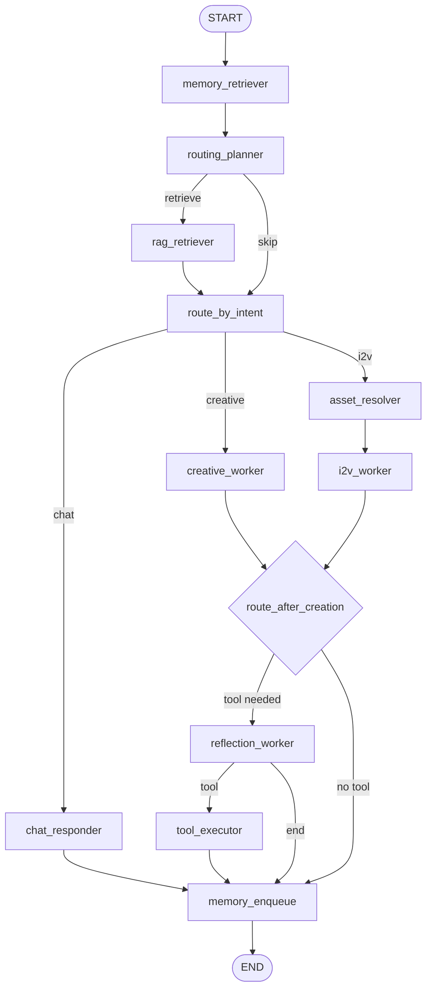

# LangGraph Agent 测试笔记：视频创作 Agent 的状态、任务与服务化验收

我这个 Agent 的核心目标很明确：做一个视频创作助手。它既能帮用户做文生视频，也能做图生视频；既能扩写 prompt、调整风格、补充镜头，也能在用户确认后真正提交生成任务。

这类 Agent 不能只看“模型回答得像不像”。真正要验收的是：它能不能分清用户意图，能不能记住当前会话，能不能处理多轮修改，能不能在调用外部视频工具前做确认，能不能被前端稳定调用。

所以这篇文章主要记录我现在这个视频 Agent 的架构，以及我怎么围绕 LangGraph 的状态、分支、异步任务和前端流式输出做测试。

---

## 一、当前 Agent 架构

现在这个视频创作 Agent 已经不是单纯的 CLI 脚本，而是拆成了三层：

```text
前端页面
  -> POST /tasks
FastAPI 任务 API
  -> 后台任务执行
LangGraph 视频创作 Agent
  -> LLM / RAG / Memory / LitMedia Tool
```

前端创建任务后，后端会立刻返回 `task_id`。Agent 在后台执行，前端通过 SSE 订阅任务事件流，实时看到任务状态。

```text
POST /tasks
GET  /tasks/{task_id}
GET  /tasks/{task_id}/events
```

这个结构把几个边界先拆清楚了：

```text
API 层负责接请求
Task Store 负责保存任务状态
Task Runner 负责执行 Agent
LangGraph 负责业务图和状态流转
```

以后如果要做分布式，可以把后台线程换成 Celery/RQ，把本地状态换成 Redis 或 Postgres。接口层不用大改。

---

## 二、LangGraph 主流程

当前 Agent 的主链路可以概括为：

```text
memory_retriever
  -> routing_planner
  -> rag_retriever?
  -> route_by_intent
```

`routing_planner` 是入口规划节点，一次结构化输出同时判断三件事：

```text
route: chat / creative / i2v
should_retrieve: true / false
retrieval_query: string | null
```

也就是说，它既判断用户是普通聊天、文生视频，还是图生视频，也判断本轮是否需要 RAG 检索。

当前主流程大概是这样：



这里最重要的是：Agent 不是每一轮都直接生成视频。它会先理解用户意图，再决定是闲聊、补全 prompt、修改已有方案，还是提交工具调用。

---

## 三、Agent 能处理哪些用户输入

这个 Agent 主要覆盖几类请求。

第一类是能力咨询，比如：

```text
你好
你能做什么
你可以帮我生成视频吗
```

这种情况下，Agent 要自然说明自己是视频创作助手，可以帮用户做文生视频和图生视频，也可以扩写 prompt、设计镜头、调整风格和优化负面词。

第二类是文生视频，比如：

```text
帮我生成一段雨夜城市街角的小狗视频
```

Agent 会把用户的一句话扩成更完整的视频 prompt，并结合默认参数，例如比例、清晰度、时长等。

第三类是图生视频，比如：

```text
用这张图生成一个镜头推进的视频
```

这时 Agent 会先解析图片资源，再生成适合图生视频的运动描述和镜头语言。

第四类是多轮修改，比如：

```text
换成新海诚风格
分辨率改成 1080p
不要水印
就按这个生成
```

这些输入都依赖会话状态。Agent 需要记住当前 prompt、参数、确认状态，以及上一轮用户到底在改什么。

---

## 四、会话状态怎么保存

前端有两个关键字段：

```text
User ID
Thread ID
```

`User ID` 表示谁在使用，`Thread ID` 表示这个用户的哪一段会话。

如果一直使用：

```text
user_id = demo
thread_id = demo-thread
```

Agent 会把它当成同一条对话。用户说“改成更治愈一点”“就用第二个”“确认生成”时，Agent 能根据同一个 `thread_id` 找回上下文。

当前线程状态会持久化到：

```text
memory/threads/
```

每个 `thread_id` 对应一个状态文件。服务重启后，再使用同一个 `thread_id`，就能读回之前的 `CreativeState`。

这一步对 Agent 服务化很重要。因为前端、API、Worker 不一定永远在同一个进程里，状态必须从“进程内记忆”逐步变成“可恢复的会话状态”。

---

## 五、为什么 Agent 会慢

LangSmith 里最值得看的不是总耗时，而是 token breakdown。

我观察过一次长会话 trace：

```text
Input: 58.5K
Output: 12.7K
Total: 71.2K
P50: 23.45s
P99: 58.85s
```

这说明慢的主要原因不是“构建图”，而是每一轮塞给 LLM 的上下文太大。

Agent 聊得越久，`chat_history` 越长。如果每个节点都塞最近 8 到 10 条历史，多个 LLM 节点叠加起来，输入 token 会膨胀得很快。

所以我对历史做了两层控制：

```text
保存会话时：最多保留最近 12 条 chat_history
调用节点时：不同节点只读取自己需要的短窗口
```

这里的关键点是：当前视频 prompt、确认状态、前端参数已经在 `params` 和 `frontend_params` 里，不需要每次把完整聊天历史重新塞进模型。

---

## 六、记忆写入不能阻塞用户响应

每轮对话结束后，Agent 都需要更新长期记忆。但记忆抽取本身也可能调用 LLM。

对用户来说，回复已经生成了，就不应该继续等记忆写入完成。否则体感上就是：Agent 明明答完了，却还卡着不返回。

现在主链路最后走的是：

```text
memory_enqueue
```

主流程只负责启动后台写入，然后结束本轮响应。记忆写入失败不会影响本轮回复。

生产环境里，这一步可以继续演进成：

```text
memory_enqueue -> Redis/Celery -> memory worker
```

这相当于把“用户响应路径”和“后台维护路径”拆开。对 Agent 来说，这是很重要的延迟优化。

---

## 七、结构化输出要能容错

Agent 里有很多结构化输出，例如意图识别、路由规划、工具调用判断。结构化输出的好处是稳定，坏处是模型稍微跑偏就可能触发校验错误。

比如模型可能返回：

```text
clarification
```

但 schema 里希望的是：

```text
clarify
```

如果不做处理，整个任务会直接失败。

所以我在 Pydantic schema 层做了归一化，把常见别名映射成系统内部标准值：

```text
clarification -> clarify
ask_clarification -> clarify
edit_prompt -> update_prompt
generate -> create_prompt
submit -> confirm
text_to_video -> submit_text_to_video
i2v -> image_to_video
replace -> overwrite
normal -> chat
```

这类容错很关键。线上 Agent 面对的是自然语言和模型输出，不是严格 API 调用。schema 不能脆到一有同义词就崩。

---

## 八、反思节点按需运行

视频生成属于有副作用的动作。真正提交工具前，Agent 需要确认参数、prompt 和工具调用是否合理。

所以图里保留了：

```text
reflection_worker
```

但它不是每一轮都需要跑。

如果用户只是让 Agent 改 prompt、换风格、补镜头，这一轮没有外部工具调用，就不需要额外反思。只有当 `tool_call` 准备调用下面这些工具时，才进入反思节点：

```text
submit_text_to_video
submit_image_to_video
```

这样既减少一次 LLM 调用，也让图的语义更清楚：只有要执行外部副作用时，才做额外检查。

---

## 九、前端流式输出流的是什么

现在前端使用 SSE：

```text
GET /tasks/{task_id}/events
```

当前流的是任务事件：

```text
task_created
task_running
agent_started
graph_building
graph_running
reply_ready
state_saved
task_completed
task_failed
```

这解决的是“前端能不能实时看到任务进度”的问题。

它还不是 token-by-token 的 LLM 流式输出。当前 LangGraph 执行主要还是：

```python
graph.invoke(...)
```

如果要做到真正的 token 流式输出，需要继续改成：

```python
graph.astream(...)
```

或者在 LLM 节点内部接流式回调，把 token 事件写进 task event stream。

我现在先把任务状态流打通，再继续往 token 级流式输出推进。

---

## 十、测试重点

这个 Agent 的测试重点不是证明模型每次都聪明，而是证明系统在多轮会话、模型轻微抖动、工具调用和服务重启后不会断。

第一类是图路径测试：

```text
chat 是否进入 chat_responder
creative 是否进入 creative_worker
i2v 是否先解析图片 URL
有 tool_call 时是否进入 reflection
没有 tool_call 时是否跳过 reflection
```

第二类是任务 API 测试：

```text
create_task 是否生成 task_id
run_agent_task 是否保存 completed / failed
同一个 thread_id 是否能保存并读回状态
```

第三类是结构化容错测试：

```text
clarification 是否归一化成 clarify
edit_prompt 是否归一化成 update_prompt
i2v 是否归一化成 image_to_video
text_to_video 是否归一化成 submit_text_to_video
```

这些测试的价值在于：不要求模型永远输出最标准的词，但要求系统能接住常见偏差。

---

## 十一、下一步分布式演进

现在这套结构已经接近一个 Agent 服务：

```text
前端
  -> FastAPI
  -> Task Store
  -> Task Runner
  -> LangGraph Agent
  -> SSE 返回事件
```

后面可以按这个顺序继续演进：

```text
1. InMemoryTaskStore -> SQLite/Postgres
2. 后台线程 -> Celery/RQ Worker
3. 本地 thread_state 文件 -> LangGraph checkpointer / Postgres
4. SSE 任务事件 -> token 级流式输出
5. 单机 Worker -> 多 Worker + 幂等工具调用
```

这条路线的核心不是一上来就堆分布式组件，而是先把边界抽清楚。只要 API、任务状态、会话状态、Agent 执行器之间的职责稳定，后面替换存储和队列就会自然很多。

---

## 小结

做 Agent 不只是写 prompt。真正让它可用的，是一圈工程护栏：

```text
路由少打模型
记忆不阻塞响应
会话能持久化
历史不能无限膨胀
结构化输出要能容错
前端要能看到任务进度
工具调用前要做确认
```

这个视频创作 Agent 现在已经具备了服务化的基本形态：前端可以创建任务，后端可以异步执行，LangGraph 可以按状态分支，线程状态可以持久化，用户也能在同一个 `thread_id` 里持续修改和确认视频方案。

接下来要继续补的是更完整的分布式任务队列、数据库 checkpointer，以及真正的 token 级流式输出。等这几块补齐后，它就不只是一个本地 Agent，而是一个可以承载多用户请求的视频创作 Agent 服务。
