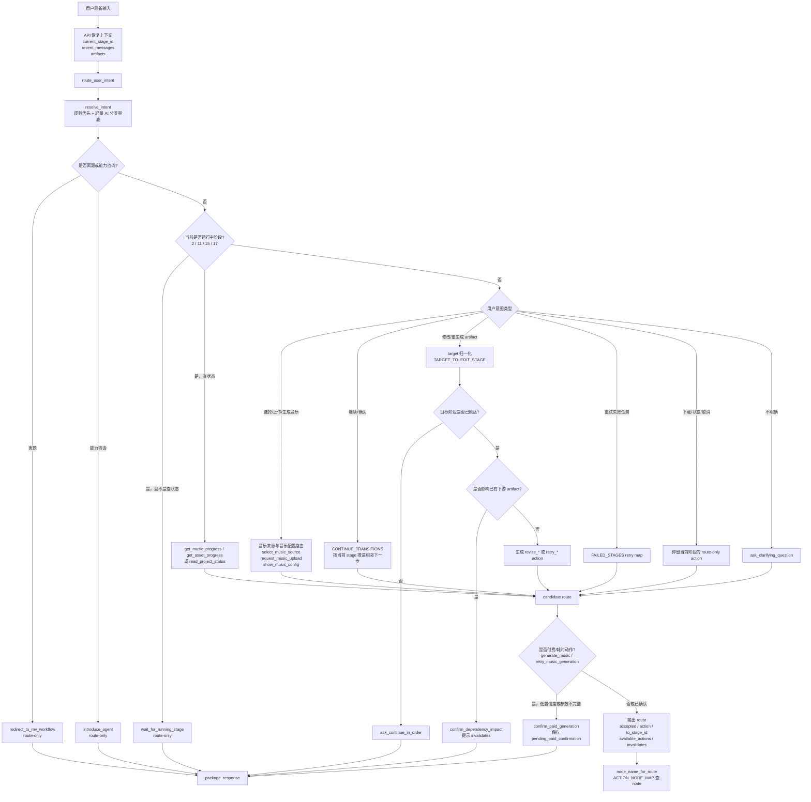
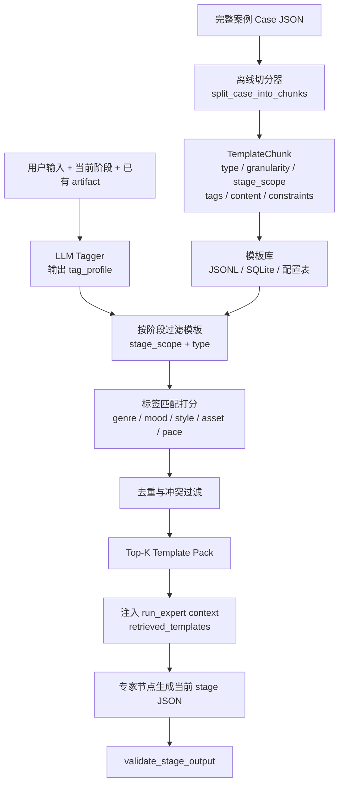

# Agent 架构介绍与技术实现

本文介绍一套 Agent 的架构设计。它不是一个简单的聊天机器人，而是一个面向“音乐 MV 生成”的业务编排系统：用户用自然语言表达需求，Agent 需要把需求拆成稳定的业务动作，按阶段推进音乐、MV 大纲、详情脚本、资产提示词、分镜、分段视频和最终合成，并把每一步产物输出成前端可以直接渲染的 JSON 卡片。

这套系统最核心的挑战不是“让模型会写内容”，而是让模型在复杂业务流里保持可控：

- 不能跳阶段：音乐没准备好，不能直接生成分镜。
- 不能乱改 schema：前端卡片依赖固定字段，模型不能多写解释文本或少字段。
- 不能误触发付费任务：生成音乐、生成视频这类动作必须有确认边界。
- 不能丢上下文：每轮聊天都要知道当前阶段和上游产物。
- 不能把路由和内容混在一起：判断“用户想做什么”和生成“当前阶段业务 JSON”必须分离。

当前实现用 FastAPI + LangChain + LangGraph + SQLite + Skill Prompt 的组合，把业务拆成几层：API 层、会话层、路由层、阶段节点层、专家生成层、响应打包层和异步任务回写层。

## 1. 总体架构

从一次聊天请求看，主链路是：

```text
用户输入
  -> FastAPI /business/chat
  -> 恢复 session context 和 artifacts
  -> LangGraph business_step
  -> route_user_intent 判断 action
  -> template_retriever 按标签召回模板包
  -> stage_guard 检查阶段和前置产物
  -> ACTION_NODE_MAP 找到业务节点
  -> NODE_REGISTRY 执行专家节点或工具节点
  -> validate_stage_output 校验 JSON
  -> package_response 打包 text + card
  -> SQLite 保存 turn 和 artifact
  -> 返回前端 data.interaction_text + data.form_data
```

对应到代码，关键模块如下：

| 模块 | 职责 |
| --- | --- |
| `business_agent/api.py` | FastAPI 入口。负责上下文恢复、请求归一、Graph 调用、流式事件、异步 task-event 回写。 |
| `business_agent/graph/builder.py` | 构建 LangGraph 主图，目前是短链路：`START -> business_step -> package -> END`。 |
| `business_agent/graph/nodes.py` | 连接路由层和阶段执行层。先 route，再按需执行显式阶段节点。 |
| `plugins/music_mv_workflow/router.py` | 意图识别和业务路由。只判断 action、目标阶段、影响范围，不生成业务卡片内容。 |
| `business_agent/stage_flow.py` | 工作流事实表。定义阶段、运行态、失败态、继续流转、action 到 node 的映射、task-event 映射。 |
| `business_agent/stage_guard.py` | 阶段守卫。防止跳过前置阶段或缺少上游 artifact 时执行下游节点。 |
| `business_agent/stage_nodes.py` | 阶段节点注册表。定义每个 node 的 stage_id、schema、skill、工具函数。 |
| `business_agent/expert_runner.py` | 调用阶段专家 LLM，并保护 JSON 输出契约。 |
| `business_agent/template_retriever.py` | 模板检索层。把用户输入分发成标签，并按标签召回大纲、视觉、资产、分镜等模板包。 |
| `business_agent/response_packager.py` | 把内部 graph state 转成前端聊天模块可消费的响应。 |
| `business_agent/session_store.py` | SQLite 记忆层。保存 session、messages、artifacts。 |
| `skills/<mv-skills>/` | 各阶段专家提示词和 few-shot 示例。 |

这个设计的重点是把“决策”和“生成”拆开。

router 只回答一个问题：用户当前想做什么？

stage node 只回答一个问题：当前 action 对应的业务产物 JSON 应该是什么？

response packager 只回答一个问题：这些内部状态如何变成前端响应？

三者不互相抢职责，整个 Agent 才能在多轮、多阶段、异步任务里保持稳定。

## 2. 为什么 LangGraph 主图很短

很多 Agent 会把所有业务节点都画进 LangGraph：router、outline、details、asset、storyboard、tools，每个节点之间再写条件边。当前项目没有这么做，而是把外层图压到非常短：

```text
START -> business_step -> package -> END
```

原因是 MV 工作流虽然阶段多，但真正的分发规则主要是业务状态机，不是图结构本身。把所有阶段都放进 LangGraph 条件边，会让条件边和业务规则散落在多个地方。当前实现把复杂度集中在三个表：

- `STAGES`：阶段事实表。
- `ACTION_NODE_MAP`：路由 action 到执行 node 的映射。
- `NODE_REGISTRY`：node 到 schema、skill、工具函数的映射。

因此 LangGraph 只负责一次稳定的执行骨架：

```python
routed_state = route_intent_node(state)
if not routed_state["node_name"]:
    return routed_state
return explicit_stage_node(node_name)(routed_state)
```

这种做法的好处是：

- 新增阶段时优先改注册表，而不是改图结构。
- route-only 动作可以自然停在打包层，不会进入专家节点。
- 阶段守卫统一生效，避免某条条件边绕过校验。
- 调试时可以直接看 `route.action -> node_name -> expert_output`。

## 3. 状态机设计

MV 生成业务的本质是一条线性流水线，中间穿插异步运行态和失败态。

主要阶段如下：

| stage_id | 阶段名 | 产物 |
| --- | --- | --- |
| 0 | `music_source_selecting` | 选择 AI 生成音乐或上传音乐 |
| 1 | `music_params_confirming` | `music_config` |
| 2 | `music_generating` | `music_result` running |
| 3 | `music_ready` | `music_result` succeeded |
| 4 | `music_failed` | `music_result` failed |
| 5 | `outline_generating` | `outline_config` |
| 6 | `outline_ready` | `outline` |
| 8 | `details_ready` | `details` |
| 10 | `asset_prompts_ready` | `asset_prompts` |
| 11 | `asset_generating` | `assets` running |
| 12 | `asset_ready` | `assets` succeeded |
| 14 | `storyboard_ready` | `storyboard` |
| 15 | `segment_video_generating` | `segment_videos` running |
| 16 | `segment_video_ready` | `segment_videos` succeeded |
| 17 | `final_video_generating` | `final_video` running |
| 18 | `final_video_ready` | `final_video` succeeded |
| 19 | `final_video_failed` | `final_video` failed |
| 20 | `asset_failed` | `assets` failed |
| 21 | `segment_video_failed` | `segment_videos` failed |

正常推进链路是：

```text
0 选择音乐来源
  -> 1 音乐参数确认
  -> 2 音乐生成中
  -> 3 音乐已就绪
  -> 5 大纲配置
  -> 6 大纲完成
  -> 8 详情完成
  -> 10 资产提示词完成
  -> 11 资产生成中
  -> 12 资产完成
  -> 14 分镜完成
  -> 15 分段视频生成中
  -> 16 分段视频完成
  -> 17 最终视频合成中
  -> 18 成片完成
```

运行中阶段是 `2、11、15、17`。这些阶段只允许查状态或等待，不能重复提交任务，也不能推进到下游。

失败阶段是 `4、19、20、21`。失败阶段允许 retry，但 retry 也不是盲目重跑。比如音乐重试属于付费/耗时动作，会先走确认守卫；资产图片由业务后端控制，Agent 只等待 task-event 回写。

## 4. 路由层：把自然语言变成业务 action

`route_user_intent` 是整个 Agent 的第一道业务闸门。它接收：

- `current_stage_id`
- 用户最新输入
- session context
- 已有 artifacts
- 最近消息
- project_id

然后输出一个 route 对象，例如：

```json
{
  "accepted": true,
  "reason": "accepted",
  "from_stage_id": 6,
  "to_stage_id": 8,
  "action": "generate_details",
  "available_actions": ["generate_details", "revise_outline"],
  "invalidates": [],
  "preserved_as_reference": []
}
```

route 只用于调度，不是前端卡片。它不能混进专家产物里。

路由判断的整体流程可以画成下面这样：



这张图里最重要的是：router 输出的是“候选调度结果”，不是最终执行许可。真正能不能跑节点，还要继续过 `ACTION_NODE_MAP` 和 `stage_guard`。

路由层有几个重要策略。

第一，规则优先。常见动作通过关键词和当前阶段直接判断，比如“继续”“下一步”“进度”“重试”“上传音乐”“换歌”“修改大纲”。规则可以覆盖高确定性的输入，减少模型误判。

第二，运行态拦截。如果当前阶段是运行中，而用户不是问进度，就返回：

```json
{
  "accepted": false,
  "reason": "stage_is_running",
  "action": "wait_for_running_stage"
}
```

这样可以避免用户在音乐生成中又发一句“继续”，导致系统重复提交生成任务。

第三，编辑目标归一化。用户可能说“换歌”“改简介”“调整人物设定”“图片重来”“成片重新生成”。router 会把这些口语化目标映射成标准 target：

```text
换歌 -> music_source/music
简介/大纲/人物设定 -> outline
详情/脚本/场景描述 -> details
角色/场景/物品/图片 -> assets
分镜/故事板 -> storyboard
成片/最终视频 -> final_video
```

第四，下游影响提示。修改上游 artifact 时，router 不会直接覆盖下游产物，而是计算 `DOWNSTREAM_INVALIDATION`。如果下游已经有产物，会先返回 `confirm_dependency_impact`，让用户知道这次修改会影响哪些内容。

例如修改 outline，可能影响：

```text
details -> assets -> storyboard -> segment_videos -> final_video
```

这个设计解决了一个很常见的问题：用户只是想把简介改得更燃一点，但如果系统直接重跑，会让后续详情、资产、分镜和视频都处于不一致状态。影响确认机制把“上游修改会带来什么后果”显式化。

## 5. action 到 node 的映射

router 输出的是 action，真正执行的是 node。

中间通过 `ACTION_NODE_MAP` 连接：

```text
show_music_config       -> music_config_node
generate_outline        -> outline_form_node
generate_outline_result -> outline_generate_node
revise_outline          -> outline_revision_node
generate_details        -> details_generate_node
revise_details          -> details_revision_node
generate_assets         -> asset_prompt_node
revise_assets           -> asset_prompt_revision_node
generate_storyboard     -> storyboard_generate_node
revise_storyboard       -> storyboard_revision_node
generate_segment_videos -> segment_video_tool_node
generate_final_video    -> final_compose_tool_node
```

没有出现在 `ACTION_NODE_MAP` 里的 action 都是 route-only。比如：

- `select_music_source`
- `request_music_upload`
- `collect_music_brief`
- `introduce_agent`
- `wait_for_running_stage`
- `confirm_paid_generation`
- `confirm_dependency_impact`
- `show_current_card`
- `read_project_status`

route-only 不生成新的业务 artifact，只返回文本、选择卡、确认卡，或者展示已有卡片。

这个边界非常重要：并不是每次用户说话都要调用专家模型。很多回合只是确认、等待、澄清、展示状态。少调用专家，既省成本，也减少随机性。

把 action、node、注册表和响应打包放到一起看，节点架构是下面这张图：

```mermaid
flowchart LR
    subgraph Input["输入与状态"]
        A["ChatRequest<br/>message / session_id / current_stage_id"]
        B["SessionStore.load_context<br/>sessions / messages / artifacts"]
        C["BusinessAgentState"]
    end

    subgraph Routing["路由层"]
        D["route_intent_node"]
        E["route_user_intent"]
        F["route<br/>action / accepted / to_stage_id"]
    end

    subgraph Dispatch["调度与守卫"]
        G["node_name_for_route"]
        H["ACTION_NODE_MAP<br/>action -> node_name"]
        I["guard_stage_order"]
        J{"allowed?"}
    end

    subgraph Registry["节点注册表"]
        K["NODE_REGISTRY[node_name]"]
        L["StageNodeSpec<br/>stage_id<br/>schema_keys<br/>skill_name<br/>output_factory<br/>is_tool_node"]
    end

    subgraph Execute["节点执行"]
        M{"是否有 output_factory?"}
        N["确定性/工具节点<br/>outline_form<br/>progress_tool<br/>segment_video_tool<br/>final_compose_tool"]
        O["专家节点 run_expert<br/>加载当前 SKILL.md<br/>加载 few-shot<br/>调用 LLM"]
        P["revision 节点<br/>读取旧 artifact<br/>完整重写 JSON<br/>judge 校验修改是否命中"]
    end

    subgraph Contract["JSON 契约保护"]
        Q["parse_json_object"]
        R["sanitize_expert_output<br/>移除 route 元数据"]
        S["validate_stage_output<br/>stage_id 匹配<br/>schema_keys 完全匹配<br/>language 枚举校验"]
    end

    subgraph Output["响应与持久化"]
        T["expert_output"]
        U["package_response<br/>text + card"]
        V["save_turn / upsert_artifact"]
        W["Public API Response<br/>data.interaction_text<br/>data.form_data"]
    end

    A --> B --> C --> D --> E --> F
    F --> G --> H --> I --> J
    J -- "否" --> U
    J -- "是" --> K --> L --> M
    M -- "是" --> N --> S
    M -- "否，普通专家" --> O --> Q --> R --> S
    M -- "否，修改已有产物" --> P --> S
    S --> T --> U --> V --> W
```



这张图可以从左到右读：输入先变成带上下文的 state；router 只产出 action；`ACTION_NODE_MAP` 找执行节点；`NODE_REGISTRY` 决定节点契约；节点执行后统一进入 JSON 契约保护；最后才打包成前端响应并写回 artifact。

## 6. 阶段守卫：router 不能被完全信任

即使 router 判断用户想生成 storyboard，也不能直接执行 `storyboard_generate_node`。因为用户可能在音乐刚完成时说“直接给我分镜”。意图是清楚的，但业务状态不允许。

所以进入节点前必须过 `guard_stage_order`。

每个 node 都声明前置条件：

| node | 最早阶段 | 必需 artifact |
| --- | --- | --- |
| `music_config_node` | 0 | 无 |
| `outline_form_node` | 3 | `music_result` |
| `outline_generate_node` | 5 | `outline_config` |
| `outline_revision_node` | 6 | `outline` |
| `details_generate_node` | 6 | `outline` |
| `details_revision_node` | 8 | `details` |
| `asset_prompt_node` | 8 | `details` |
| `asset_prompt_revision_node` | 10 | `asset_prompts` |
| `storyboard_generate_node` | 12 | `assets` |
| `storyboard_revision_node` | 14 | `storyboard` |
| `segment_video_tool_node` | 14 | `storyboard` |
| `final_compose_tool_node` | 16 | `segment_videos` |

守卫检查两件事：

1. 当前 `current_stage_id` 是否已经到达最早阶段。
2. context 或 artifacts 中是否存在必需上游产物。

如果不满足，就把 route 改成：

```json
{
  "accepted": false,
  "reason": "missing_prerequisite",
  "action": "ask_continue_in_order"
}
```

这样即使路由层误判，执行层也不会跳阶段。

## 7. 阶段节点注册表：JSON 契约的唯一事实来源

`NODE_REGISTRY` 是控制 JSON 输出最关键的结构。每个节点都是一个 `StageNodeSpec`：

```python
StageNodeSpec(
    name="outline_generate_node",
    stage_id=6,
    schema_keys=frozenset({
        "stage_id",
        "title",
        "audioUrl",
        "musicDuration",
        "aspectRatio",
        "language",
        "style",
        "introduction",
        "characterSettings",
    }),
    skill_name="mv-outline-skill",
)
```

它同时定义四件事：

- 这个节点输出哪个 `stage_id`。
- 顶层 JSON 字段必须有哪些。
- 是否需要加载某个 skill 调用 LLM。
- 是否有 `output_factory`，也就是是否可以确定性生成或调用工具。

当前节点分三类。

第一类是专家节点。没有 `output_factory`，会调用 `run_expert`，例如大纲、详情、资产提示词、分镜生成。

第二类是确定性节点。有 `output_factory`，但不一定调用外部工具，例如 `outline_form_node` 直接从 context 组装：

```json
{
  "stage_id": 5,
  "language": "en",
  "aspectRatio": "9:16",
  "style": "real_person"
}
```

第三类是工具节点。有 `output_factory` 且 `is_tool_node=True`，例如查询音乐进度、查询资产进度、分段视频任务占位、最终合成任务占位。

所有节点无论来自 LLM 还是代码生成，都必须经过同一个校验函数：

```python
validate_stage_output(node_name, output)
```

校验规则很硬：

- `output["stage_id"]` 必须等于 node 声明的 `stage_id`。
- `set(output.keys())` 必须和 `schema_keys` 完全一致。
- 不能少字段。
- 不能多字段。
- 如果包含 `language`，必须在支持范围内。
- 音乐配置节点还会做参数归一化。

这里故意采用“完全匹配”，而不是“至少包含”。原因是前端卡片、session artifact、后续节点都依赖稳定 schema。模型多输出一个 `route`、`message`、`explanation` 或 `metadata`，看似无害，实际会污染状态库，后续节点可能误读。

## 8. 如何控制 LLM 只输出 JSON

本系统对 JSON 输出用了多层防线。

### 8.1 Prompt 层：明确专家只是第二阶段生成器

`run_expert` 的 system prompt 会明确告诉模型：

- route AI 已经选好了 action。
- 你不能重新解释用户意图。
- 你不能选择别的节点。
- 你不能推进到其他阶段。
- 你只能输出当前业务节点的纯 JSON。
- 不允许 Markdown、解释、代码块、自然语言回复。
- 不允许输出 route、action、messages、canvas_events 等内部字段。
- 顶层字段必须严格等于 `expected_schema_keys`。

这其实是在限制模型的“自由度”。模型越想帮忙，越容易把调度信息、解释文本、下一步建议混进输出。这里要反过来告诉它：你的工作不是聊天，也不是调度，只是填当前卡片。

### 8.2 HumanMessage 层：把契约、skill、few-shot、route、context 分区

给模型的用户消息不是简单塞一段需求，而是分区：

```text
Node output contract:
- expected_stage_id
- expected_top_level_keys
- forbidden_top_level_keys
- output_type: one JSON object only

Current skill:
<当前阶段 SKILL.md>

Few-shot examples:
<positive/negative examples>

Route result:
<仅供调度参考，不可输出>

Project context:
<上游产物和会话上下文>

Latest user input:
<用户最新输入>
```

这种格式的好处是模型知道哪些是约束、哪些是参考、哪些是内容输入。

### 8.3 解析层：只接受 JSON object

模型输出后会进入 `parse_json_object`。

它兼容一种情况：模型把 JSON 包在代码块里。系统会尝试提取代码块里的 `{...}`。但最终必须能被 `json.loads` 解析成 dict。

如果不是合法 JSON，直接抛错。

### 8.4 清洗层：删除 route 元数据

即使 prompt 已禁止，系统仍会清洗这些字段：

```text
action
available_actions
from_stage_id
from_stage_name
to_stage_id
to_stage_name
invalidates
preserved_as_reference
accepted
reason
```

清洗后还会校验 `stage_id` 是否匹配当前 route 预期阶段。

### 8.5 Schema 层：顶层字段完全匹配

最后用 `validate_stage_output` 做强校验：

```python
keys = set(output)
if keys != spec.schema_keys:
    raise ValueError(...)
```

这一步是最硬的兜底。Prompt 让模型尽量守规矩，代码校验保证不守规矩的输出不会进入系统。

## 9. 修改已有产物：不是 patch，而是完整重写 + 校验

用户经常会说：

- “把简介改得更燃一点。”
- “女主换成银色短发。”
- “分镜里多一点雨夜氛围。”
- “资产提示词保持风格，但角色更年轻。”

这类修改不能简单重跑生成节点。因为重跑可能把用户不想改的字段也洗掉。也不能只让模型输出 patch，因为字段级 patch 对复杂嵌套 JSON 很脆弱，容易漏改、路径错、类型错。

当前策略是：读取旧 artifact，让模型基于旧卡片输出完整新卡片。

流程是：

```text
用户修改请求
  -> router 识别 edit_artifact + target
  -> action 映射到 *_revision_node
  -> stage_guard 确认旧 artifact 存在
  -> _rewrite_stage_output
  -> 模型输出完整新 JSON
  -> validate_stage_output 完整 schema 校验
  -> _revision_satisfies_user_request 用小 judge 判断是否满足修改
  -> 不满足则重试一次
  -> 满足后覆盖写回 artifact
```

`_rewrite_stage_output` 的 prompt 强调：

- 使用 previous card 作为基础。
- 用户要求必须被明确体现。
- 输出一个完整 JSON 对象。
- 顶层 key 必须完全等于当前 node schema。
- 不要输出 wrapper、route、Markdown 或解释。

然后 `_revision_satisfies_user_request` 再调用一次小模型判断：

```json
{
  "satisfied": true,
  "reason": "..."
}
```

如果旧输出和新输出完全相同，直接判定失败。第一次不满足会重试一次；第二次仍不满足，就抛错，不写库。

这个设计在稳定性上比较均衡：

- 比字段 patch 更适合复杂 JSON。
- 比完全重生更能保留上下文。
- 通过 schema 校验保证前端仍能渲染。
- 通过 judge 防止模型“看起来输出了 JSON，但没有真的改到用户要改的点”。

## 10. 付费/耗时任务的二次确认

生成音乐、重试音乐这类动作可能触发外部付费或耗时任务。系统不能因为一句模糊的“继续”就直接发起。

router 里有一层确认守卫：

```text
PAID_GENERATION_ACTIONS = {
  "generate_music",
  "retry_music_generation"
}
```

当 action 命中这些动作时，会检查两件事：

- 意图置信度是否足够高。
- 所需参数是否完整。

如果不满足，就返回：

```json
{
  "accepted": false,
  "reason": "needs_paid_generation_confirmation",
  "action": "confirm_paid_generation",
  "paid_confirmation": {
    "stage_id": 1,
    "target": "music",
    "pending_action": "generate_music",
    "parameters": {
      "project_id": "...",
      "music_description": "...",
      "voice_selection": "...",
      "music_type": "..."
    }
  }
}
```

`response_packager` 会把它打包成确认卡，并让 `ok=false`。同时 `session_store` 会把 `pending_paid_confirmation` 保存成 artifact。用户下一轮确认后，router 再从 session context 取回 pending action，恢复真实动作。

这里有一个细节：确认时会检查 pending 的 `stage_id` 是否仍等于当前 stage，防止用户跨阶段后又触发过期任务。

## 11. 异步任务：Agent 不直接等外部生成完成

音乐、资产图片、分段视频、最终合成都可能是异步任务。Agent 不应该在聊天请求里阻塞等待，也不应该凭空编造完成状态。

当前系统用 `POST /business/task-event` 回写任务结果。

典型事件映射：

| event_type | 写入 stage_id | artifact_key | status |
| --- | --- | --- | --- |
| `music_started` | 2 | `music_result` | running |
| `music_uploaded` | 3 | `music_result` | succeeded |
| `music_completed` | 3 | `music_result` | succeeded |
| `music_failed` | 4 | `music_result` | failed |
| `assets_started` | 11 | `assets` | running |
| `assets_completed` | 12 | `assets` | succeeded |
| `assets_failed` | 20 | `assets` | failed |
| `segment_videos_started` | 15 | `segment_videos` | running |
| `segment_videos_completed` | 16 | `segment_videos` | succeeded |
| `segment_videos_failed` | 21 | `segment_videos` | failed |
| `final_video_started` | 17 | `final_video` | running |
| `final_video_completed` | 18 | `final_video` | succeeded |
| `final_video_failed` | 19 | `final_video` | failed |

回写时会做两件事：

1. 清洗敏感字段，例如 token、authorization、signature。
2. 写入 SQLite artifacts，并更新 session 当前阶段。

下一轮用户聊天时，只要带同一个 `session_id`，`_hydrate_request_context` 就会自动把这些 artifact 恢复进 context。

这就把“聊天决策”和“异步生产”解耦了。Agent 负责知道现在该做什么，外部业务系统负责真正生成，完成后用 task-event 告诉 Agent。

## 12. 会话记忆：session + messages + artifacts

SQLite 中有三张核心表：

- `sessions`：当前阶段、用户、项目、locale、状态。
- `messages`：用户消息、assistant 文本、系统事件、turn record。
- `artifacts`：每个阶段的结构化产物。

artifact 以 `session_id + artifact_key` 唯一，例如：

```text
music_config
music_result
outline_config
outline
details
asset_prompts
assets
storyboard
segment_videos
final_video
pending_paid_confirmation
```

每轮请求开始时，`load_context` 会把 artifacts 放在两处：

```python
context["artifacts"]["outline"] = {...}
context["outline"] = {...}
```

这样既支持新代码统一从 `context.artifacts` 读，也兼容旧节点从平铺字段读。

同时它还会把最近 12 条对话恢复为 `recent_messages`，让 router 能判断用户是否正在回答上一轮追问。

这个记忆层是整个多轮 Agent 的地基。没有它，模型每轮都只能看到用户最新一句，无法知道音乐是否已完成、大纲是否存在、当前能不能继续。

## 13. 响应打包：内部 state 和前端协议分离

内部 graph state 包含很多字段：

```text
route
node_name
skill_name
expert_output
assistant_text
context
error
```

但前端不应该直接消费这些内部结构。`package_response` 会统一压成：

```json
{
  "code": 200,
  "ok": true,
  "stage_id": 6,
  "interaction_text": "...",
  "messages": [
    {"type": "text", "content": "..."},
    {"type": "card", "data": {"stage_id": 6, "...": "..."}}
  ]
}
```

最后 `_public_chat_response` 再压缩成对外 API 结构：

```json
{
  "code": 200,
  "msg": "成功",
  "data": {
    "stage_id": 6,
    "interaction_text": "...",
    "form_data": {
      "stage_id": 6,
      "title": "...",
      "audioUrl": "...",
      "musicDuration": 90,
      "aspectRatio": "9:16",
      "language": "en",
      "style": "real_person",
      "introduction": "...",
      "characterSettings": []
    }
  }
}
```

打包层会按场景选择不同响应：

- 音乐来源选择：返回 `music_source_selection` 卡片。
- 缺音乐 brief：只返回追问文本。
- 付费确认：返回 `paid_generation_confirmation` 卡片，并设置 `ok=false`。
- 展示当前卡片：从 context 取已有 artifact，不重新生成。
- 专家产物：返回 text + card，并生成 `stage_output_ready` 语义事件。
- route-only 兜底：只返回文本。

这层让前端永远面对相对稳定的 `interaction_text + form_data`，不用理解内部 route 和节点细节。

## 14. 流式接口

`/business/chat/stream` 使用 NDJSON 事件。它和非流式接口共用同一套路由和阶段节点，只是把结果拆成事件：

```text
route
analysis_delta
analysis_done
stage_output_ready
done
```

当前实现不是重新生成一份“分析过程”，而是把最终用户可见文本作为流式 lead text 输出，避免流式和非流式逻辑分叉导致答案不一致。

前端可以先展示 `analysis_delta`，等 `stage_output_ready` 到达后更新右侧画布卡片，最后用 `done` 收尾。

## 15. Skill Prompt 和 few-shot

每个内容生成阶段都有独立 skill：

- `mv-music-generation-skill`
- `mv-outline-skill`
- `mv-details-skill`
- `mv-asset-skill`
- `mv-storyboard-skill`

专家节点不会一次性加载所有技能，而是按当前 node 的 `skill_name` 加载对应 `SKILL.md`。这样有两个好处：

- Prompt 更短，模型只看当前阶段规则。
- 职责更清晰，outline 专家不会被 details 或 storyboard 的 schema 干扰。

few-shot 通过 `load_fewshot_examples` 读取：

```text
_fewshot/<skill_name>/positive.jsonl
_fewshot/<skill_name>/negative.jsonl
```

每类最多取若干条，并过滤不支持语言的示例，避免 few-shot 把模型带到错误语言上。

这里的 few-shot 不只是“好例子”，还有 negative examples。对复杂 JSON 生成来说，反例很重要：它可以提醒模型不要输出旧字段、不要语言混杂、不要改变 schema。

## 16. 模板检索层：从完整案例切 chunk，再按标签注入专家节点

模板检索层的核心不是“搜一段相似文本”，而是把历史完整案例拆成一组可复用 chunk。每个 chunk 都有明确用途、适用阶段、标签和内容字段。在线生成时，Agent 先把用户输入打成标签，再按当前节点选择合适的 chunk 注入给专家节点。

整体链路如下：



### 16.1 完整案例长什么样

一个完整案例需要是结构化 JSON，而不是一篇文章。它至少包含用户 brief、音乐信息、标签、大纲、详情、资产、分镜、提示词片段和质量标注。后续切 chunk 的时候，所有模板都从这些字段里提取。

简化后的案例结构如下：

```json
{
  "case_id": "case_001_neon_rain_reunion",
  "source": {
    "user_brief": "做一个雨夜赛博朋克风的都市爱情MV，孤独但最后有情绪爆发。",
    "music": {
      "music_description": "中速都市流行，前半段克制孤独，副歌有强烈情绪释放。",
      "duration": 90,
      "lyrics_summary": "雨夜、错过、寻找、重逢、释怀"
    },
    "selected_config": {
      "language": "zh_tw",
      "aspectRatio": "9:16",
      "style": "real_person"
    }
  },
  "tags": {
    "genre": ["urban", "romance", "cyberpunk"],
    "mood": ["lonely", "bittersweet", "emotional_release"],
    "story_type": ["missed_connection", "reunion"],
    "visual_style": ["neon_noir", "rainy_city", "real_person"],
    "camera_style": ["tracking", "slow_push_in", "close_up"],
    "pace": "medium_fast",
    "asset_type": ["female_lead", "male_lead", "city_street", "symbolic_item"]
  },
  "outline": {
    "title": "雨夜重逢",
    "musicDuration": 90,
    "language": "zh_tw",
    "style": "real_person",
    "introduction": "霓虹閃爍的雨夜，女主角在城市街頭尋找一段未完成的告別...",
    "characterSettings": []
  },
  "details": {
    "scenes": []
  },
  "asset_prompts": {
    "characters": [],
    "scenes": [],
    "items": []
  },
  "storyboard": {
    "storyboard_list": []
  },
  "prompt_patterns": {
    "positive_blocks": [],
    "negative_blocks": []
  },
  "quality_annotations": {
    "good_for": ["urban romance", "neon rainy city", "emotional chorus release"],
    "avoid_for": ["bright comedy", "pastoral scenery"],
    "reusable_parts": ["story_arc", "style_block", "character_block", "shot_pattern", "prompt_block"]
  }
}
```

这份 case 的作用不是直接喂给生成模型，而是作为“模板原料”。离线切分器会从中拆出多个 `TemplateChunk`。

这些 tag 的中文含义如下：

| tag 字段 | 中文含义 | 示例 |
| --- | --- | --- |
| `genre` | 题材/类型，用来判断故事大方向。 | `urban` 都市，`romance` 爱情，`cyberpunk` 赛博朋克 |
| `mood` | 情绪氛围，用来控制故事和画面的情绪。 | `lonely` 孤独，`bittersweet` 苦甜，`emotional_release` 情绪释放 |
| `story_type` | 叙事结构，用来选择故事推进方式。 | `missed_connection` 错过，`reunion` 重逢 |
| `visual_style` | 视觉风格，用来匹配画面、灯光和质感模板。 | `neon_noir` 霓虹黑色电影，`rainy_city` 雨夜城市，`real_person` 真人风 |
| `camera_style` | 镜头语言，用来匹配分镜和运镜模板。 | `tracking` 跟拍，`slow_push_in` 慢推，`close_up` 特写 |
| `pace` | 节奏，用来控制剪辑和镜头时长。 | `medium_fast` 中快节奏 |
| `asset_type` | 资产类型，用来召回角色、场景、物品模板。 | `female_lead` 女主，`city_street` 城市街道，`symbolic_item` 象征物 |

### 16.2 从完整案例里取哪些 chunk

一个完整案例可以拆成七类 chunk：

| chunk 类型 | 来源字段 | 用途 |
| --- | --- | --- |
| `story_arc` | `outline.introduction` + `details.scenes` | 复用故事起承转合。 |
| `emotion_curve` | `source.music` + `details.scenes` | 复用情绪推进节奏。 |
| `style_block` | `tags.visual_style` + `asset_prompts` + `storyboard` | 复用视觉风格、色彩、光线、材质。 |
| `character_block` | `outline.characterSettings` + `asset_prompts.characters` | 复用角色外貌、服装、性格信号、一致性约束。 |
| `scene_block` | `details.scenes` + `asset_prompts.scenes` | 复用场景空间、环境、构图、风格约束。 |
| `item_block` | `asset_prompts.items` | 复用关键物品和象征意义。 |
| `shot_pattern` | `storyboard.storyboard_list` | 复用镜头组合、运镜、转场和时长节奏。 |
| `prompt_block` | `asset_prompts.*.image_prompt` + `storyboard.*.video_prompt` + `prompt_patterns` | 复用稳定提示词片段和负向约束。 |

例如从一个雨夜重逢案例里取下来的 `story_arc` 可以长这样：

```json
{
  "chunk_id": "case_001_story_arc",
  "source_case_id": "case_001_neon_rain_reunion",
  "type": "narrative",
  "granularity": "story_arc",
  "stage_scope": ["outline", "details"],
  "tags": {
    "genre": ["urban", "romance"],
    "mood": ["lonely", "emotional_release"],
    "story_type": ["missed_connection", "reunion"]
  },
  "content": {
    "opening": "主角在强氛围场景中独自出现，建立孤独感。",
    "conflict": "旧关系被重新唤起，但现实距离阻止两人靠近。",
    "turning_point": "音乐高潮处出现主动奔赴或情绪爆发。",
    "ending": "结尾保留余韵，关系不完全解释。"
  },
  "constraints": {
    "max_injected_chars": 500,
    "can_combine_with": ["visual", "storyboard"]
  }
}
```

一个角色 chunk 可以长这样：

```json
{
  "chunk_id": "case_001_character_female_lead",
  "source_case_id": "case_001_neon_rain_reunion",
  "type": "asset",
  "granularity": "character_block",
  "stage_scope": ["asset", "storyboard"],
  "tags": {
    "asset_type": ["female_lead"],
    "genre": ["urban", "romance"],
    "visual_style": ["real_person", "neon_noir"],
    "mood": ["lonely"]
  },
  "content": {
    "role": "female_lead",
    "appearance": "短银发，心形脸，眼神冷淡但有情绪张力。",
    "wardrobe": "黑色皮外套，银色耳饰。",
    "personality_signal": "疏离、敏感、情绪压抑。",
    "consistency_constraints": [
      "保持发型和脸型一致",
      "保持服装主色为黑色和银色",
      "避免不同镜头中角色气质漂移"
    ]
  },
  "constraints": {
    "max_injected_chars": 600,
    "can_combine_with": ["visual", "prompt", "storyboard"]
  }
}
```

一个分镜 chunk 可以长这样：

```json
{
  "chunk_id": "case_001_shot_chorus_release",
  "source_case_id": "case_001_neon_rain_reunion",
  "type": "storyboard",
  "granularity": "shot_pattern",
  "stage_scope": ["details", "storyboard"],
  "tags": {
    "pace": ["medium_fast"],
    "mood": ["emotional_release"],
    "camera_style": ["tracking", "slow_push_in", "close_up"]
  },
  "content": {
    "pattern": [
      "wide establishing shot to reset location",
      "tracking shot following the character moving forward",
      "close-up on face at lyric accent",
      "cutaway to symbolic item",
      "slow push-in during emotional peak"
    ],
    "duration_rule": "8-15 seconds per shot group",
    "transition_style": "match cut or rain reflection dissolve"
  }
}
```

### 16.3 chunk 怎么存

每个 chunk 都用统一结构存储，便于过滤、打分、去重和注入：

```json
{
  "chunk_id": "case_001_style_neon_rain",
  "source_case_id": "case_001_neon_rain_reunion",
  "type": "visual",
  "granularity": "style_block",
  "stage_scope": ["outline", "asset", "storyboard"],
  "tags": {
    "genre": ["urban", "cyberpunk"],
    "mood": ["lonely", "tense"],
    "visual_style": ["neon_noir", "rainy_city"],
    "scene": ["city_street", "night"]
  },
  "slots": ["palette", "lighting", "texture", "avoid"],
  "content": {
    "palette": ["electric blue", "magenta", "wet asphalt black"],
    "lighting": "neon reflections, backlight, rim light",
    "texture": "rain mist, glossy pavement, shallow depth of field",
    "avoid": ["flat daylight", "clean studio look"]
  },
  "constraints": {
    "max_injected_chars": 500,
    "can_combine_with": ["narrative", "asset", "storyboard"],
    "conflicts_with": ["bright_daylight", "pastoral_soft"]
  }
}
```

存储上可以先按类型分文件：

```text
templates/
  narrative.jsonl
  visual.jsonl
  asset.jsonl
  storyboard.jsonl
  prompt.jsonl
```

每行是一个 chunk JSON。后续如果需要更强查询能力，可以把同样结构迁到 SQLite 或其他检索表里，但字段结构保持不变。

标准 chunk 字段含义如下：

| 字段 | 作用 |
| --- | --- |
| `chunk_id` | chunk 唯一 ID，用于召回、去重、日志追踪。 |
| `source_case_id` | 来源案例 ID，用于追溯模板从哪个完整案例切出。 |
| `type` | 大类：narrative、visual、asset、storyboard、prompt。 |
| `granularity` | 细粒度：story_arc、emotion_curve、style_block、character_block、scene_block、item_block、shot_pattern、prompt_block。 |
| `stage_scope` | 适用阶段，防止把不该出现的模板注入当前节点。 |
| `tags` | 匹配用标签。 |
| `slots` | 这个 chunk 会影响哪些内容槽位。 |
| `content` | 真正注入给 LLM 的内容。 |
| `constraints` | 长度、冲突、组合关系等控制信息。 |

### 16.4 怎么给 chunk 打 tag

tag 有两种来源。

第一种是继承案例级标签。比如完整案例已经有：

```json
{
  "genre": ["urban", "romance", "cyberpunk"],
  "mood": ["lonely", "emotional_release"],
  "visual_style": ["neon_noir", "rainy_city"],
  "pace": "medium_fast"
}
```

切出来的 chunk 会继承其中和自己相关的标签。`story_arc` 继承 `genre / mood / story_type`，`style_block` 继承 `visual_style / mood / scene`，`shot_pattern` 继承 `pace / mood / camera_style`。

第二种是从 chunk 内容里补充局部标签。比如角色 chunk 会额外补 `asset_type=female_lead`，场景 chunk 会补 `scene=city_street/rainy_night`，提示词 chunk 会补 `quality=cinematic/real_person`。

离线切分器可以用规则 + LLM 双层处理：

```text
完整案例 tags
  -> 规则继承到 chunk
chunk content
  -> LLM tagger 补充局部标签
  -> 标签白名单归一化
  -> 写入 chunk.tags
```

LLM tagger 的输出必须是固定 JSON：

```json
{
  "genre": ["urban", "romance"],
  "mood": ["lonely", "emotional_release"],
  "story_type": ["reunion"],
  "visual_style": ["neon_noir", "rainy_city"],
  "camera_style": ["tracking", "close_up"],
  "asset_type": ["female_lead"],
  "scene": ["city_street", "rainy_night"],
  "pace": "medium_fast"
}
```

为了避免标签发散，需要维护一份标签白名单，例如：

| tag 字段 | 可选值 | 中文注释 |
| --- | --- | --- |
| `genre` | `urban`, `romance`, `cyberpunk`, `campus`, `fantasy`, `suspense` | 题材：都市、爱情、赛博朋克、校园、奇幻、悬疑。 |
| `mood` | `lonely`, `dreamy`, `tense`, `healing`, `high_energy`, `emotional_release` | 情绪：孤独、梦幻、紧张、治愈、高能、情绪释放。 |
| `story_type` | `reunion`, `missed_connection`, `escape`, `growth`, `revenge`, `confession` | 叙事类型：重逢、错过、逃离、成长、复仇、告白。 |
| `visual_style` | `neon_noir`, `rainy_city`, `film_retro`, `bright_campus`, `dark_gothic`, `real_person` | 视觉风格：霓虹黑色电影、雨夜城市、复古胶片、明亮校园、暗黑哥特、真人风。 |
| `camera_style` | `tracking`, `handheld`, `slow_push_in`, `close_up`, `wide_establishing` | 镜头语言：跟拍、手持、慢推、特写、远景建立。 |
| `asset_type` | `female_lead`, `male_lead`, `city_street`, `symbolic_item`, `vehicle`, `room` | 资产类型：女主、男主、城市街道、象征物、交通工具、房间。 |
| `pace` | `slow`, `medium`, `medium_fast`, `fast` | 节奏：慢、中等、中快、快。 |

### 16.5 生成时给 LLM 输入什么

在线生成时，专家节点拿到的输入分五部分：

```text
当前节点 schema 契约
用户最新输入
上游 artifacts
当前阶段 skill prompt 和 few-shot
retrieved_templates
```

不同节点注入的模板类型不同：

| 当前节点 | 必给上游内容 | 推荐模板 |
| --- | --- | --- |
| `outline_generate_node` | 用户需求、音乐信息、歌词、大纲配置 | `story_arc`, `emotion_curve`, `style_block` |
| `details_generate_node` | outline、人物设定、音乐时长、语言 | `story_arc`, `emotion_curve`, `shot_pattern` |
| `asset_prompt_node` | outline 角色、details 场景、语言、风格 | `style_block`, `character_block`, `scene_block`, `item_block`, `prompt_block` |
| `storyboard_generate_node` | details、assets、音乐时长、语言 | `shot_pattern`, `style_block`, `prompt_block` |
| `*_revision_node` | 用户修改要求、旧 artifact、相关上游产物 | 和修改目标相关的 chunk |

注入给 LLM 时，模板包可以压缩成这样：

```json
{
  "retrieved_templates": [
    {
      "chunk_id": "case_001_story_arc",
      "type": "narrative",
      "granularity": "story_arc",
      "match_reason": "genre=urban/romance, mood=lonely, story_type=reunion",
      "content": {
        "opening": "主角在强氛围场景中独自出现，建立孤独感。",
        "conflict": "旧关系被重新唤起，但现实距离阻止两人靠近。",
        "turning_point": "音乐高潮处出现主动奔赴或情绪爆发。",
        "ending": "结尾保留余韵，关系不完全解释。"
      }
    },
    {
      "chunk_id": "case_001_style_neon_rain",
      "type": "visual",
      "granularity": "style_block",
      "match_reason": "visual_style=neon_noir/rainy_city",
      "content": {
        "palette": ["electric blue", "magenta"],
        "lighting": "neon reflections, rim light",
        "avoid": ["flat daylight"]
      }
    }
  ]
}
```

专家 prompt 里要明确：模板只能作为创作参考，不能改变当前节点 schema。

```text
Retrieved templates are creative references only.
Use them to improve story structure, visual consistency, asset detail, and shot rhythm.
Do not output chunk_id, source_case_id, tags, scores, or retrieved_templates.
The final JSON schema is still controlled by NODE_REGISTRY.
```

### 16.6 根据什么匹配输入

匹配分三步。

第一步，按当前节点过滤：

```text
outline_generate_node    -> narrative + visual
details_generate_node    -> narrative + storyboard
asset_prompt_node        -> visual + asset + prompt
storyboard_generate_node -> storyboard + visual + prompt
revision_node            -> 和修改目标相关的类型
```

第二步，按标签打分：

```text
score =
  3.0 * stage_scope_match
+ 2.0 * visual_style_overlap
+ 1.5 * genre_overlap
+ 1.5 * mood_overlap
+ 1.2 * story_type_overlap
+ 1.0 * asset_type_overlap
+ 0.8 * camera_style_overlap
+ 0.5 * pace_match
```

第三步，做去重和冲突过滤：

- 同一 `source_case_id` 不要占满全部 Top-K，避免风格过窄。
- 同一 `granularity` 保留 1-3 个，避免模板过重。
- `conflicts_with` 命中的 chunk 不同时注入。
- 优先保留和上游已采用风格一致的 chunk，保证多阶段一致性。

这样生成时的逻辑就很清晰：用户输入先打标签，标签和当前节点共同决定召回哪些 chunk，chunk 只作为专家节点的参考输入，最终输出仍然由 `NODE_REGISTRY` 和 `validate_stage_output` 控制。

## 17. 语言和本地化控制

系统里有两类语言：

第一类是交互语言，也就是 Agent 和用户聊天用什么语言。API 会根据用户最新输入推断 locale，除非调用方显式传入 `locale`。

第二类是 MV 内容语言，也就是大纲、详情、资产、分镜里的内容字段用什么语言。这个由 stage 5 的 `language` 配置决定，目前支持：

```text
en
zh_tw
ja
```

`validate_stage_output` 会检查输出里的 `language` 是否属于支持范围，防止模型输出 `zh_cn`、`ko` 或自然语言标签。

这层设计把“界面交互语言”和“作品内容语言”分开。用户可以用中文聊天，但选择 MV 内容语言为英文；后续内容字段仍应使用英文。

## 18. 为什么要把 route 字段和 card 字段隔离

这是整个系统里最容易踩坑的点。

route 字段是内部调度信息：

```text
action
accepted
reason
from_stage_id
to_stage_id
available_actions
invalidates
preserved_as_reference
```

card 字段是前端业务卡片：

```text
stage_id
title
audioUrl
musicDuration
aspectRatio
language
style
introduction
characterSettings
```

如果让模型在同一个 JSON 里同时输出 route 和 card，会出现几个问题：

- 前端卡片 schema 被污染。
- session artifact 写入内部调度字段。
- 后续节点从 artifact 读取 context 时误把 route 当业务字段。
- 修改已有产物时，模型可能保留过期 action。
- 调试时不知道问题来自路由还是生成。

所以当前架构强制二者分离：

- route 只存在于 graph state 和可选调试输出。
- card 只存在于 `expert_output` / `form_data`。
- `sanitize_expert_output` 删除 route 元数据。
- `validate_stage_output` 禁止多余字段。

这就是 JSON 控制的核心原则：模型可以参与生成内容，但不能定义协议边界。

## 19. 一个完整例子

假设用户从上传音乐开始：

```text
用户：我上传了这首歌，帮我做一个赛博朋克风的 MV
请求带 url/duration/lyrics
```

API 会把上传音乐归一化成：

```json
{
  "stage_id": 3,
  "status": "succeeded",
  "source": "uploaded",
  "url": "...",
  "music_url": "...",
  "duration": 90,
  "music_duration": 90,
  "lyrics": "..."
}
```

并写入 `music_result`。

下一轮用户说：

```text
继续
```

router 根据 stage 3 的 continue transition 得到：

```json
{
  "accepted": true,
  "to_stage_id": 5,
  "action": "generate_outline"
}
```

`ACTION_NODE_MAP` 映射到：

```text
generate_outline -> outline_form_node
```

`outline_form_node` 是确定性节点，输出：

```json
{
  "stage_id": 5,
  "language": "en",
  "aspectRatio": "9:16",
  "style": "real_person"
}
```

前端展示配置卡。用户确认后，API 从聊天文本抽取配置，写入 `outline_config`，router 再把“继续”映射成：

```text
generate_outline_result -> outline_generate_node
```

这次 `outline_generate_node` 是专家节点，会加载大纲专家 skill，结合 `music_result`、`outline_config`、歌词和用户描述生成完整大纲 JSON。输出必须完全匹配：

```json
{
  "stage_id": 6,
  "title": "...",
  "audioUrl": "...",
  "musicDuration": 90,
  "aspectRatio": "9:16",
  "language": "en",
  "style": "real_person",
  "introduction": "...",
  "characterSettings": []
}
```

校验通过后写入 `outline` artifact。后续 details、assets、storyboard 都用同样模式推进。

## 20. 扩展一个新阶段应该改哪里

如果要新增一个业务阶段，不建议先改 prompt。应该先明确系统契约：

1. 在 `stage_flow.py` 里新增 `StageDefinition`。
2. 如果它是可继续流转的一环，补 `CONTINUE_FLOW`。
3. 在 `ACTION_NODE_MAP` 里声明 action 到 node 的映射。
4. 在 `NODE_PREREQUISITE_SPECS` 里声明最早阶段和必需 artifact。
5. 在 `stage_nodes.py` 里新增 `StageNodeSpec`。
6. 如果需要 LLM，新增或复用 skill，并定义精确 schema。
7. 如果是异步任务，在 `TASK_EVENT_SPECS` 里补 event 到 artifact 的映射。
8. 在测试里覆盖 route、guard、schema、session artifact 和 task-event。

这个顺序很重要。先定义状态和 schema，再写 prompt。否则模型可能已经会生成内容，但系统没有稳定方式接住它。

## 21. 这套架构的几个设计取舍

第一，短 LangGraph + 强注册表，而不是复杂图。这样业务规则更集中，修改成本更低。

第二，route 和 expert 两段式，而不是一次大 prompt。这样能区分“意图判断错了”还是“内容生成错了”。

第三，schema 完全匹配，而不是宽松兼容。这样可以早失败，避免脏数据进入 artifacts。

第四，异步任务通过 task-event 回写，而不是聊天请求里等待。这样 Agent 不需要长期阻塞，也不会假装任务完成。

第五，修改用完整卡片重写，而不是 JSON patch。这样更适合复杂业务 JSON，但必须配合 schema 校验和 judge。

第六，付费动作需要确认。Agent 的自然语言理解永远可能误判，涉及成本或耗时时必须有人类确认边界。

## 22. 总结

这类 Agent 的关键不是“一个模型写完整 MV”，而是把模型放进一个可验证、可恢复、可调试的业务状态机里。

这套架构把系统拆成几层：

- FastAPI 负责入口和上下文恢复。
- SQLite 负责长期会话和 artifacts。
- router 负责把自然语言变成 action。
- template retriever 负责把用户输入分发成标签，并召回匹配的创作模板。
- stage guard 负责守住阶段顺序。
- node registry 负责定义每个业务节点的 schema 契约。
- expert runner 负责受约束地调用 LLM。
- response packager 负责前端协议。
- task-event 负责异步任务回写。

模型在这里不是全能控制器，而是被限制在合适位置的“阶段专家”。它可以生成大纲、详情、资产提示词和分镜，但不能随意改阶段、不能污染 route、不能改变前端 schema、不能误触发付费任务。

这也是 Agent 工程化最重要的一点：不要把确定性边界交给模型。状态流转、schema 校验、任务回写、上下文恢复，都应该由代码接管；模型只在需要创造内容的地方发挥作用。
